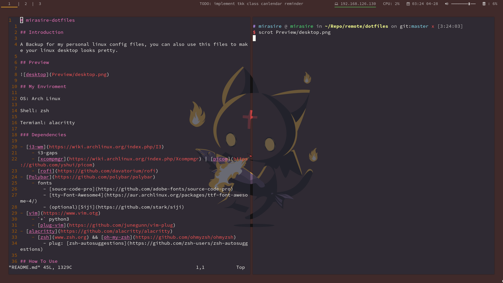
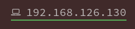
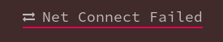

# mirasire-dotfiles

## Introduction

A Backup for my personal linux config files, you can also use this files to make your linux desktop looks pretty.

## Preview

## My Enviroment

OS: Arch Linux

Shell: zsh

Termianl: alacritty

### Dependencies

- [i3-wm](https://wiki.archlinux.org/index.php/I3)
    - i3-gaps
    - [xcompmgr](https://wiki.archlinux.org/index.php/Xcompmgr) | [picom](https://github.com/yshui/picom)
    - [rofi](https://github.com/davatorium/rofi)
- [Polybar](https://github.com/polybar/polybar)
    - fonts
        - [souce-code-pro](https://github.com/adobe-fonts/source-code-pro)
        - [tty-Font-Awesome4](https://aur.archlinux.org/packages/ttf-font-awesome-4/)
        - (optional)[Siji](https://github.com/stark/siji)
- [vim](https://www.vim.otg)
    - `+` python3 
    - [plug-vim](https://github.com/junegunn/vim-plug)
- [alacritty](https://github.com/alacritty/alacritty)
    - [zsh](www.zsh.org) && [oh-my-zsh](https://github.com/ohmyzsh/ohmyzsh)
        - plug: [zsh-autosuggestions](https://github.com/zsh-users/zsh-autosuggestions)

## How To Use

> `i3` need to `cp i3-wm/myScript /usr/bin`

Instead the default config file by the files in this repository.

`i3` and `polybar`'s config file are in the `~/config/i3/config` and `~/config/polybar/config`.

## More things

### about my polybar feature

1. The module named `eth` shows your network status.
    - `green` means all right.
    - 
    - `red` means it can't connet to the net.
    - 
