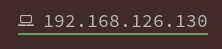

# mirasire-dotfiles

[English](README_en.md)

## 介绍

这个仓库主要用来保存我的一些配置文件。

## 预览图片

## 我的环境

OS: Arch Linux

Shell: zsh

Termianl: alacritty

## 所需的依赖

- [i3-wm](https://wiki.archlinux.org/index.php/I3)
    - i3-gaps
    - [xcompmgr](https://wiki.archlinux.org/index.php/Xcompmgr) | [picom](https://github.com/yshui/picom)
    - [rofi](https://github.com/davatorium/rofi)
- [Polybar](https://github.com/polybar/polybar)
    - python>=3.2
        - BeautifulSoup4
        - lxml
        - html5lib
    - fonts
        - [souce-code-pro](https://github.com/adobe-fonts/source-code-pro)
        - [tty-Font-Awesome4](https://aur.archlinux.org/packages/ttf-font-awesome-4/)
        - (optional)[Siji](https://github.com/stark/siji)
- [vim](https://www.vim.otg)
    - `+` python3 
    - [plug-vim](https://github.com/junegunn/vim-plug)
- [alacritty](https://github.com/alacritty/alacritty)
    - [zsh](www.zsh.org) && [oh-my-zsh](https://github.com/ohmyzsh/ohmyzsh)
        - plug: [zsh-autosuggestions](https://github.com/zsh-users/zsh-autosuggestions)

## 如何使用我的配置文件？

## 便利小功能

1. 网络状态显示，在polybar的设置中是`moudle/eth`
    - `绿色`网络连接正常
    - 
    - `红色`表示没网了
    - 
2. TKK(厦门大学嘉庚学院) 的 课程提示器
    - 在前20分钟会提醒课程
    - 支持从[教学文件系统 ](http://jw.xujc.com) 上导出的html文件
    - 
    - 
    - 
    - 
    - 计划：支持学校的课程范围和单双周制度。
